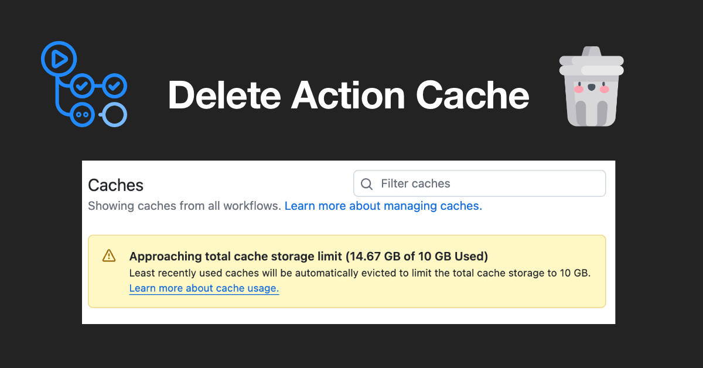

[](https://github.com/toshimaru/delete-action-cache/actions/workflows/test.yml)

# Delete Action Cache

Delete GitHub Actions cache with ease.



## Motivation

GitHub Actions cache is limited to 10GB per repository. If you use a lot of cache storage, you may see the following warning message:

> **Approaching total cache storage limit (XX GB of 10 GB Used)**
>
> Least recently used caches will be automatically evicted to limit the total cache storage to 10 GB. [Learn more about cache usage.](https://docs.github.com/actions/using-workflows/caching-dependencies-to-speed-up-workflows#usage-limits-and-eviction-policy)

The documentation says:

> GitHub will remove any cache entries that have not been accessed in over 7 days. There is no limit on the number of caches you can store, but the total size of all caches in a repository is limited to 10 GB. Once a repository has reached its maximum cache storage, the cache eviction policy will create space by deleting the oldest caches in the repository.

[Usage limits and eviction policy - GitHub Docs](https://docs.github.com/en/actions/writing-workflows/choosing-what-your-workflow-does/caching-dependencies-to-speed-up-workflows#usage-limits-and-eviction-policy)

To prevent reaching this limit, it’s essential to delete unused or unnecessary caches automatically.

## Usage

### Delete caches after a pull request is closed/merged

```yml
name: Delete Action Cache
on:
  pull_request_target:
    types: [closed]
jobs:
  delete-cache:
    runs-on: ubuntu-latest
    steps:
      - uses: toshimaru/delete-action-cache@main
```

### Delete caches manually

```yml
name: Delete Action Cache
on:
  worklflow_dispatch:
jobs:
  delete-cache:
    runs-on: ubuntu-latest
    steps:
      - uses: toshimaru/delete-action-cache@main
```

- Select a branch from dropdown menu
- Click "Run workflow"
- The action deletes the branch caches

See also. [Manually running a workflow - GitHub Docs](https://docs.github.com/en/actions/managing-workflow-runs-and-deployments/managing-workflow-runs/manually-running-a-workflow)

## Inputs

See [action.yml](action.yml)

| Name | Description | Default |
| - | - | - |
| `github-token` | A token for the repository | `github.token` |
| `limit` | The number of caches to delete | 100 |
| `branch` | The branch name where the cache is stored | - |
| `repo` | The repository name | `github.repository` |

## Supported Events

- `pull_request`
- `pull_request_target`
- `workflow_dispatch`
- `push`
