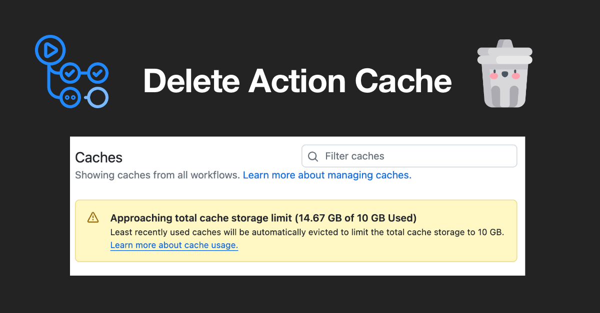
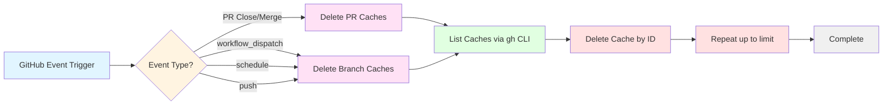

[](https://github.com/toshimaru/delete-action-cache/actions/workflows/test.yml)

# Delete Action Cache

Automatically delete GitHub Actions cache entries to manage your repository's 10GB cache storage limit.



## Table of Contents

- [Overview](#overview)
- [Features](#features)
- [The Problem](#the-problem)
- [Quick Start](#quick-start)
- [How It Works](#how-it-works)
- [Usage](#usage)
  - [Delete PR Caches on Close/Merge](#delete-pr-caches-on-closemerge)
  - [Manual Cache Deletion](#manual-cache-deletion)
  - [Scheduled Cache Cleanup](#scheduled-cache-cleanup)
  - [Delete Caches on Push](#delete-caches-on-push)
  - [Delete Specific Branch Caches](#delete-specific-branch-caches)
- [Configuration](#configuration)
- [Supported Events](#supported-events)
- [Development](#development)
- [Testing](#testing)
- [Troubleshooting](#troubleshooting)
- [Contributing](#contributing)
- [License](#license)

## Overview

Delete Action Cache is a GitHub Action that automatically removes cached artifacts from your workflows. It helps you stay within GitHub's 10GB cache storage limit by providing flexible, event-driven cache cleanup strategies.

This action is a composite action that leverages the GitHub CLI (`gh`) to interact with the GitHub Actions cache API.

## Features

- ✅ **Automatic cleanup** on pull request close/merge
- ✅ **Manual deletion** via workflow dispatch
- ✅ **Scheduled cleanup** using cron expressions
- ✅ **Branch-specific** cache targeting
- ✅ **Configurable limits** on number of caches to delete
- ✅ **Cross-platform support** (Ubuntu, Windows, macOS)
- ✅ **Zero dependencies** - uses GitHub CLI built into runners
- ✅ **Multiple event triggers** - PR, push, schedule, manual

## The Problem

GitHub Actions cache is limited to **10GB per repository**. When you approach this limit, you'll see:

> **Approaching total cache storage limit (XX GB of 10 GB Used)**
>
> Least recently used caches will be automatically evicted to limit the total cache storage to 10 GB.

GitHub's automatic eviction policy:

> GitHub will remove any cache entries that have not been accessed in over 7 days. There is no limit on the number of caches you can store, but the total size of all caches in a repository is limited to 10 GB. Once a repository has reached its maximum cache storage, the cache eviction policy will create space by deleting the oldest caches in the repository.

[Usage limits and eviction policy - GitHub Docs](https://docs.github.com/en/actions/writing-workflows/choosing-what-your-workflow-does/caching-dependencies-to-speed-up-workflows#usage-limits-and-eviction-policy)

Without proactive management, hitting the cache limit can cause:

- 🐌 Slower builds (cache misses)
- ❌ Workflow failures
- ⏱️ Inconsistent build times
- 📉 Reduced CI/CD efficiency

**This action solves the problem** by providing automated, configurable cache deletion strategies that work seamlessly with your development workflow.

## Quick Start

Add this workflow to automatically clean up PR caches when pull requests are closed:

```yaml
# .github/workflows/delete-cache.yml
name: Delete Action Cache
on:
  pull_request_target:
    types: [closed]

jobs:
  delete-cache:
    runs-on: ubuntu-latest
    permissions:
      actions: write
    steps:
      - uses: toshimaru/delete-action-cache@v1
```

> **Note:** The `actions: write` permission is required to delete caches.

## How It Works


```mermaid
graph LR
    A[GitHub Event Trigger] --> B{Event Type?}
    B -->|PR Close/Merge| C[Delete PR Caches]
    B -->|workflow_dispatch| D[Delete Branch Caches]
    B -->|schedule| D
    B -->|push| D
    C --> E[List Caches via gh CLI]
    D --> E
    E --> F[Delete Cache by ID]
    F --> G[Repeat up to limit]
    G --> H[Complete]

    style A fill:#e1f5ff
    style B fill:#fff4e1
    style C fill:#ffe1f5
    style D fill:#ffe1f5
    style E fill:#e1ffe1
    style F fill:#ffe1e1
    style G fill:#ffe1e1
    style H fill:#f0f0f0
```

### Architecture

This action is implemented as a **composite action** that:

1. **Receives event context** from GitHub Actions (event name, branch, PR number, etc.)
2. **Determines the appropriate ref** based on the triggering event
3. **Uses the GitHub CLI** (`gh cache list` and `gh cache delete`) to interact with the cache API
4. **Iterates through caches** and deletes them up to the configured limit
5. **Logs deletion activity** for transparency and debugging

The action handles different event types:

- **Pull Request Events** (`pull_request`, `pull_request_target`): Deletes caches for both the PR merge ref (`refs/pull/{number}/merge`) and the PR branch (`refs/heads/{branch}`)
- **Manual/Push/Schedule Events** (`workflow_dispatch`, `push`, `schedule`): Deletes caches for the current ref
- **Branch-Specific**: When a branch is explicitly provided, only caches for that branch are deleted

## Usage

### Delete PR Caches on Close/Merge

Automatically clean up caches when pull requests are closed or merged. This is the most common use case and prevents abandoned PR caches from consuming storage.

```yaml
name: Delete Action Cache
on:
  pull_request_target:
    types: [closed]

jobs:
  delete-cache:
    runs-on: ubuntu-latest
    permissions:
      actions: write
    steps:
      - uses: toshimaru/delete-action-cache@v1
```

**Why use `pull_request_target`?**

- `pull_request_target` runs in the context of the base repository, giving it necessary permissions to delete caches
- More secure for public repositories with external contributors
- See [GitHub Docs on `pull_request_target`](https://docs.github.com/en/actions/using-workflows/events-that-trigger-workflows#pull_request_target)

### Manual Cache Deletion

Use `workflow_dispatch` to manually trigger cache deletion from the GitHub Actions UI.

```yaml
name: Delete Action Cache
on:
  workflow_dispatch:

jobs:
  delete-cache:
    runs-on: ubuntu-latest
    permissions:
      actions: write
    steps:
      - uses: toshimaru/delete-action-cache@v1
```

**To run manually:**

1. Go to **Actions** tab in your repository
2. Select **Delete Action Cache** workflow
3. Click **Run workflow**
4. Select a branch from the dropdown
5. Click **Run workflow** button

The action will delete caches associated with the selected branch.

See [Manually running a workflow - GitHub Docs](https://docs.github.com/en/actions/managing-workflow-runs-and-deployments/managing-workflow-runs/manually-running-a-workflow)

### Scheduled Cache Cleanup

Delete caches periodically using cron expressions. Useful for maintaining cache hygiene on active branches.

```yaml
name: Delete Action Cache
on:
  schedule:
    # Runs at 3 AM UTC daily
    - cron: '0 3 * * *'

jobs:
  delete-cache:
    runs-on: ubuntu-latest
    permissions:
      actions: write
    steps:
      - uses: toshimaru/delete-action-cache@v1
        with:
          limit: 50
```

**Cron Schedule Examples:**

- `'0 3 * * *'` - Daily at 3 AM UTC
- `'0 3 * * 0'` - Weekly on Sundays at 3 AM UTC
- `'0 */6 * * *'` - Every 6 hours

Use [crontab.guru](https://crontab.guru/) to build and validate cron expressions.

### Delete Caches on Push

Automatically clean up caches when code is pushed to specific branches.

```yaml
name: Delete Action Cache
on:
  push:
    branches:
      - main

jobs:
  delete-cache:
    runs-on: ubuntu-latest
    permissions:
      actions: write
    steps:
      - uses: toshimaru/delete-action-cache@v1
        with:
          limit: 10
```

### Delete Specific Branch Caches

Target a specific branch for cache deletion regardless of the triggering event.

```yaml
name: Delete Action Cache
on:
  workflow_dispatch:

jobs:
  delete-cache:
    runs-on: ubuntu-latest
    permissions:
      actions: write
    steps:
      - uses: toshimaru/delete-action-cache@v1
        with:
          branch: feature/experimental
          limit: 100
```

This is useful when:

- Cleaning up caches from old or stale branches
- Managing caches for specific long-running feature branches
- Troubleshooting cache-related issues on particular branches

## Configuration

All inputs are optional with sensible defaults. Configure the action by providing `with:` parameters.

### Inputs

| Input | Description | Default | Required |
|-------|-------------|---------|----------|
| `github-token` | GitHub token with `actions: write` permission | `github.token` | No |
| `limit` | Maximum number of caches to delete per run | `100` | No |
| `branch` | Specific branch name for cache deletion (e.g., `main`, `develop`) | Auto-detected from event context | No |
| `repo` | Repository in `owner/repo` format | `github.repository` | No |
| `head-ref` | Override for `github.head_ref` (PR source branch) | `github.head_ref` | No |
| `pr-number` | Override for pull request number | `github.event.number` | No |
| `ref` | Override for `github.ref` (current Git ref) | `github.ref` | No |

See [action.yml](action.yml) for complete input definitions.

### Example with Custom Configuration

```yaml
name: Delete Action Cache
on:
  workflow_dispatch:

jobs:
  delete-cache:
    runs-on: ubuntu-latest
    permissions:
      actions: write
    steps:
      - uses: toshimaru/delete-action-cache@v1
        with:
          github-token: ${{ secrets.GITHUB_TOKEN }}
          limit: 50
          branch: develop
          repo: ${{ github.repository }}
```

### Permissions

The action requires the `actions: write` permission to delete caches. Add this to your workflow:

```yaml
permissions:
  actions: write
```

Or at the job level:

```yaml
jobs:
  delete-cache:
    permissions:
      actions: write
```

## Supported Events

The action intelligently handles different GitHub event types:

| Event | Description | Cache Deletion Behavior |
|-------|-------------|------------------------|
| `pull_request` | Triggered on PR events | Deletes PR merge ref and PR branch caches |
| `pull_request_target` | Triggered on PR events (base repo context) | Deletes PR merge ref and PR branch caches |
| `workflow_dispatch` | Manually triggered | Deletes caches for selected branch |
| `schedule` | Cron-based trigger | Deletes caches for default branch (or specified branch) |
| `push` | Triggered on push to branch | Deletes caches for pushed branch |

## Development

### Prerequisites

- Git
- GitHub CLI (`gh`) - pre-installed on GitHub-hosted runners
- Access to a GitHub repository with Actions enabled

### Local Testing

This action is designed to run within GitHub Actions and relies on the GitHub CLI and runner environment. For local development:

1. **Clone the repository:**

   ```bash
   git clone https://github.com/toshimaru/delete-action-cache.git
   cd delete-action-cache
   ```

2. **Review the action definition:**

   ```bash
   cat action.yml
   ```

3. **Test in a GitHub Actions workflow:**

   The action must be tested in an actual GitHub Actions workflow. Use the provided test workflow:

   ```bash
   # View test workflow
   cat .github/workflows/test.yml
   ```

   Push your changes to a branch and observe the test workflow run.

### Project Structure

```
.
├── action.yml           # Action definition and composite steps
├── .github/
│   └── workflows/
│       ├── test.yml     # Test workflow
│       ├── release.yml  # Release automation
│       └── update-main-version.yml  # Version tag management
├── fixture/             # Test fixture for cache generation
│   └── package.json
├── img/                 # Images for documentation
├── LICENSE              # MIT License
├── README.md            # This file
└── VERSION              # Version number
```

### Making Changes

1. **Edit `action.yml`** for action logic changes
2. **Update `README.md`** for documentation changes
3. **Test thoroughly** using the test workflow
4. **Update `VERSION`** file for releases

## Testing

The project includes a comprehensive test workflow that validates the action across multiple platforms and scenarios.

### Test Workflow

Location: `.github/workflows/test.yml`

The test workflow:

1. **Generates caches** using different package managers (npm, yarn) across multiple OS platforms (Ubuntu, Windows, macOS)
2. **Runs the action** with various configurations
3. **Validates deletion** functionality

### Running Tests

Tests run automatically on:

- Push to any branch
- Pull requests
- Manual trigger via `workflow_dispatch`

**To run tests manually:**

1. Go to **Actions** tab
2. Select **Test** workflow
3. Click **Run workflow**

### Test Coverage

The test workflow validates:

- ✅ Basic cache deletion with limit
- ✅ Custom parameter configuration
- ✅ Branch-specific deletion
- ✅ Cross-platform compatibility (Ubuntu, Windows, macOS)
- ✅ Multiple package managers (npm, yarn)

## Troubleshooting

### Common Issues

#### 1. "Permission denied" or "Resource not accessible"

**Problem:** The action cannot delete caches due to insufficient permissions.

**Solution:** Add `actions: write` permission to your workflow:

```yaml
permissions:
  actions: write
```

#### 2. "No caches found to delete"

**Problem:** The action runs but reports no caches to delete.

**Solution:** This is normal if:

- No caches exist for the target branch/ref
- All caches were recently deleted
- The branch name is incorrect

Verify cache existence:

```bash
gh cache list --repo owner/repo --ref refs/heads/branch-name
```

#### 3. Rate Limiting

**Problem:** GitHub API rate limits exceeded.

**Solution:**

- Reduce `limit` parameter value
- Space out scheduled runs (e.g., daily instead of hourly)
- Use the default `github.token` which has higher rate limits

#### 4. Cache deletion doesn't reduce storage immediately

**Problem:** Cache storage metric doesn't update right away.

**Solution:** GitHub's cache storage metrics can take time to update. Wait a few minutes and refresh.

#### 5. Action fails on private repositories

**Problem:** Action works on public repos but fails on private ones.

**Solution:** Ensure the token has appropriate permissions. The default `github.token` should work, but custom tokens need `actions: write` scope.

### Debugging

Enable debug logging by setting the `ACTIONS_STEP_DEBUG` secret to `true` in your repository:

1. Go to **Settings** → **Secrets and variables** → **Actions**
2. Add new repository secret: `ACTIONS_STEP_DEBUG` = `true`
3. Re-run the workflow

This will provide detailed logs for troubleshooting.

### Getting Help

- **Issues:** [Report bugs or request features](https://github.com/toshimaru/delete-action-cache/issues)
- **Discussions:** [Ask questions or share ideas](https://github.com/toshimaru/delete-action-cache/discussions)
- **GitHub Docs:** [Actions Cache Documentation](https://docs.github.com/en/actions/using-workflows/caching-dependencies-to-speed-up-workflows)

## Contributing

Contributions are welcome! Here's how you can help:

### Ways to Contribute

- 🐛 **Report bugs** - Open an issue with details and reproduction steps
- 💡 **Suggest features** - Share ideas for improvements
- 📖 **Improve documentation** - Fix typos, add examples, clarify instructions
- 🔧 **Submit pull requests** - Fix bugs or implement features

### Contribution Workflow

1. **Fork the repository**

   ```bash
   gh repo fork toshimaru/delete-action-cache --clone
   ```

2. **Create a feature branch**

   ```bash
   git checkout -b feature/your-feature-name
   ```

3. **Make your changes**

   - Edit `action.yml` for functionality changes
   - Update `README.md` for documentation changes
   - Follow existing code style and conventions

4. **Test your changes**

   - Test in a workflow on your fork
   - Ensure all test scenarios pass
   - Validate on multiple platforms if changing core logic

5. **Commit and push**

   ```bash
   git add .
   git commit -m "feat: add your feature description"
   git push origin feature/your-feature-name
   ```

6. **Open a pull request**

   - Provide clear description of changes
   - Link related issues
   - Include test results if applicable

### Code of Conduct

- Be respectful and inclusive
- Provide constructive feedback
- Focus on the best solution for users

## License

This project is licensed under the MIT License - see the [LICENSE](LICENSE) file for details.

## Credits

**Author:** [Toshimaru](https://github.com/toshimaru)

**Built with:**

- [GitHub CLI](https://cli.github.com/)
- [GitHub Actions](https://github.com/features/actions)

---

**Helpful Resources:**

- [GitHub Actions Documentation](https://docs.github.com/en/actions)
- [Cache Dependency Documentation](https://docs.github.com/en/actions/using-workflows/caching-dependencies-to-speed-up-workflows)
- [GitHub CLI Manual](https://cli.github.com/manual/)

---

⭐ If you find this action useful, please consider giving it a star!
